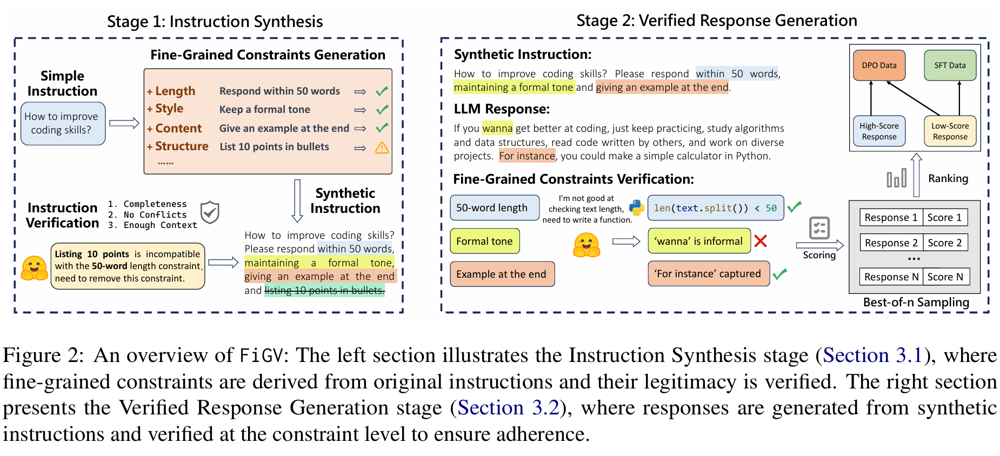

# [ACL 2025 GEM2 Workshop] Fine-Grained Constraint Generation-Verification for Improved Instruction-Following

FiGV is an open-source pipeline that automatically builds high-quality instruction-following data for large language models (LLMs).
The system runs in two stages:

* Instruction Synthesis – an LLM proposes fine-grained, category-diverse constraints for a seed instruction and discards any that are contradictory or ill-formed.

* Verified Response Generation – multiple candidate answers are produced and each individual constraint is checked with a hybrid judge that blends LLM reasoning with lightweight, LLM-generated Python functions, giving a reliable “constraint-following” score.



## Install the dependencies

```bash
pip install -r requirements.txt
```

## Data Generation

### 1. Prepare the seed prompt

You need to prepare seed prompts for the data generation. The seed prompts should be organized in a jsonl file, where each line is a json object with the following fields: {'prompt': str}.
For example, the seed prompt file can be like this:

```json
{"prompt": "Write an original joke that includes the word orange."}
{"prompt": "Which two countries in South America do not share a border with Brazil?"}
```

Below are some possible datasets that you can use as seed prompts:
- [ShareGPT](https://huggingface.co/datasets/RyokoAI/ShareGPT52K)
- [LMSYS-Chat](https://huggingface.co/datasets/lmsys/lmsys-chat-1m). We provide synthesized data on this dataset in [`datasets/`](datasets/) folder
- [Alpaca](https://huggingface.co/datasets/tatsu-lab/alpaca)
- [Open Assistant](https://huggingface.co/datasets/OpenAssistant/oasst2)

### 2. Generate the data

Execute the scripts below sequentially to generate the dataset:
    
- Filter the input, then augment and verify the prompt.
```bash
python 1_generate_prompt.py --input_file <path_to_seed_prompt_file> \
                    --output_file <output_dir> \ 
                    --num_threads <number_of_threads_for_api_call> \
                    --api_key <your_api_key> \
                    --base_url <url_for_api> \
                    --model_name <model_name>
```
- Extract the constraints from the augmented prompt.
```bash
python 2_extract_constraint.py --input_file <path_to_augmented_prompt_file> \
                    --output_file <output_dir> \
                    --num_threads <number_of_threads_for_api_call> \
                    --api_key <your_api_key> \
                    --base_url <url_for_api> \
                    --model_name <model_name>
```
- Use LLM to generate the verification function for the extracted constraints and cross-validate them.
```bash
python 3_1_generate_func.py --input_file <path_to_extracted_constraints_file> \
                    --output_file <output_dir> \
                    --num_threads <number_of_threads_for_api_call> \
                    --api_key <your_api_key> \
                    --base_url <url_for_api> \
                    --model_name <model_name>

python 3_2_cross_validation.py --input_file <path_to_verification_function_file> \
                    --output_file <output_dir> \
```

- Generate the response to the augmented prompt and verify the response by both LLM and LLM-generated verification function. The prompt-response pair can be used in the SFT stage.
```bash
python 4_generate_response.py --input_file <path_to_augmented_prompt_file> \
                    --output_file <output_dir> \
                    --num_threads <number_of_threads_for_api_call> \
                    --api_key <your_api_key> \
                    --base_url <url_for_api> \
                    --model_name <model_name> \
                    --threshold <threshold_for_response_to_be_selected>
```

- Generate the DPO data using the same verification method as above.
```bash
python 5_dpo_data.py --input_file <path_to_augmented_prompt_file> \
                    --output_file <output_dir> \
                    --num_threads <number_of_threads_for_api_call> \
                    --api_key <your_api_key> \
                    --base_url <url_for_api> \
                    --model_name <model_name> \
                    --threshold <threshold_for_chosen> \
                    --diff_threshold <threshold_for_chosen_minus_rejected>
```

## Training

We use [LLaMA-Factory](https://github.com/hiyouga/LLaMA-Factory) for both SFT and DPO training. Please refer to the repository for more details.

## Evaluation

We use the following benchmarks for evaluation in the paper:
- [IFEval](https://github.com/google-research/google-research/tree/master/instruction_following_eval)
- [FollowBench](https://github.com/YJiangcm/FollowBench)
- [InfoBench](https://github.com/qinyiwei/InfoBench)
